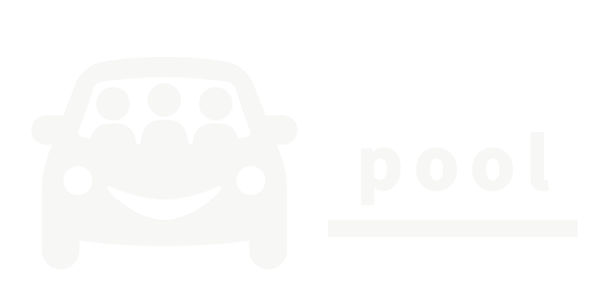

# Pool: A Simple Carpooling App

## Inspiration
Planning events is already a hassle and transportation is just another problem. For every group, carpooling is ideal for quick transportation. With Pool, we have an easy and convenient way to organize carpooling. No more carpooling spreadsheets and no more coordinating group chats; just set up a Pool and send it to your friends. It’s just that simpool!

## What it does
Pool gives our users a simple way to plan carpooling. By using Pool, they are able to create a new Pool and send a shareable link to everyone in the party. With this link, people can add themselves as drivers, which create groups, or add themselves to a driver’s car. Not only that, we allow users to communicate on the Pool through the use of a chat room for each car. 

One of the biggest advantages of Pool is its accessibility and ease of use: no new accounts, just a link. With this, we hope to create a simple experience for everyone involved whether they are trying to organize an event or find a ride. Because of this design choice, Pool is targeting an audience for smaller, casual groups. When joining, a user will have the ability to input a name when viewing a chat room or joining a car, but that will be up to them to use any name they choose. 

## How we built it
Firebase/Node.js backend with a React.js/MUI front end

## What's next for Pool
- Making it cross platform (Android, iOS, Web)
- Better User experience with transitioning between different pages and functions
- More polish on keeping track of current user’s name and allowing others to add people
- Fixing bugs 
- Creating optional accounts
